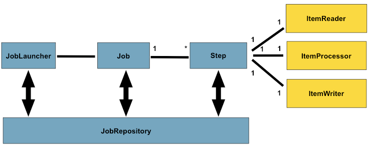

### Domain Language of the Spring batch:

The preceding diagram highlights the key concepts that make up the domain language of Spring Batch. 
A Job has one to many steps, each of which has exactly one ItemReader, one ItemProcessor, and one ItemWriter.
A job needs to be launched (with JobLauncher), and metadata about the currently running process needs to be stored (in JobRepository).

* Job = logical uint job is combined of job instance + job parameters + job execution.
     job consist with job name + define and ordering steps + if job is restable.
* Steps = every Job is composed entirely of one or more steps. A Step contains all of the information necessary to define and control the actual batch processing.
        As with a Job, a Step has an individual StepExecution that correlates with a unique JobExecution

* Job, step, itemReader, itemWriter, itemProcessor chunk and whatever configuration has lister support
* ExecutionContext  of step execution and job execution. Can retrieve during step or job

    ExecutionContext ecStep = stepExecution.getExecutionContext(); // step execution context
    ExecutionContext ecJob = jobExecution.getExecutionContext();  // job execution context

* JobRepository = persistence mechanism for job, step and jobLauncher. JobExecution + StepExecution are bypassing the information to job repository
* JobLauncher = Launch the job with job parameter
* ItemReader = ItemReader is an abstraction that represents the retrieval of input for a Step, one item at a time
* ItemWriter = ItemWriter is an abstraction that represents the output of a Step, one batch or chunk of items at a time
* ItemProcessor = ItemProcessor is an abstraction that represents the business processing of an item. 
                  While the ItemReader reads one item, and the ItemWriter writes them, the ItemProcessor provides an access point to transform or apply other business processing. If, 
                  while processing the item, it is determined that the item is not valid, returning null indicates that the item should not be written out

### Configure Job:

   * **@EnableBatchProcessing** handles all the things that necessary to configure Job. As above pic a Job requires the jobRepository.
   * In java config needs **@EnableBatchProcessing** and two builder factory called **JobBuilderFactory** and **StepBuilderFactory** as following

    JobRepository: bean name "jobRepository"
    
    JobLauncher: bean name "jobLauncher"
    
    JobRegistry: bean name "jobRegistry"
    
    PlatformTransactionManager: bean name "transactionManager"
    
    JobBuilderFactory: bean name "jobBuilders"
    
    StepBuilderFactory: bean name "stepBuilders"
   * **BatchConfigurer.class** can be used for custom job configure means custom jobRepository, custom transaction, Job launcher etc. extending the **DefaultBatchConfigurer** class can also be used
   * Job can be defined with parallelization (**Split**), declarative flow control (**Decision**) and externalization of flow definitions (**Flow**). 
   * Job can be configured with restart or not to restart means job can be created with new job instance every time
   * **Intercepting Job Execution** can be defined with listener by interface **JobExecutionListener**.
   * **JobParametersValidator** can be configured with validator. There is a **DefaultJobParametersValidator** that can be used
   * To launch the Job there needs a **Job launcher**, there is **SimplerJobLauncher** to configure jobLauncher. 
   * Advanced metadata of Job usage: **JobOperators, JobExplorer, Job registry, JobParametersIncrementer, stop, start and aborting the job**
   
### Configure Step:
* Step contains all necessary information (ItemReader, ItemProcessor,ItemWriter) to define and control the actual batch processing
* Step works in two ways: Chunk oriented and tasklet

#### Chunk oriented step: 
* chunk oriented processing refers to reading the data one at a time and creating 'chunks' and Once the number of items read equals the commit interval, the entire chunk is written out by the ItemWriter, and then the transaction is committed.
* A chunk-oriented step can also be configured with an optional **ItemProcessor** to process items before passing them to the ItemWriter
* In case of item processor, item reader first read all the items into defined chunk and itemProcessor start works. Not like every item read and process.
* Like **JobBuilderFactory** to define job there is **StepBuilderFactory** to define the step
* Commit interval means define chunk When it reaches defined chunk, the list of aggregated items is passed to the ItemWriter, and the transaction is committed.
* if one of the transaction is failed means all the transaction defined in chunk will fail because step use transaction manager
* **Configuring a Step for Restart** : for example .startLimit(1) and .allowStartIfComplete(true) default is false means not allow restart if completed before
* In case error scenario Step allow to configure skipLogic like skipLimit, skip, noSkip, retry, rollback and transaction attribut (isolation, propagation, and timeout)

#### Step execution Listener: 
    * public interface StepExecutionListener extends StepListener {}
    * public interface ChunkListener extends StepListener {}
    * public interface ItemReadListener<T> extends StepListener {}
    * public interface ItemProcessListener<T, S> extends StepListener {}
    * public interface ItemWriteListener<S> extends StepListener {}
#### Tasklet: 
* Another way to define task beside chunk oriented. Tasklet returns null for example clean the file directories.

#### Controlling the flow of step: 
 * Spring batch provides different way to flow the step: Check Controlling Step flow chapter 

### ItemReader and itemWriter:
  #### Use chapter 6 as reference of how Item reader and Iterm writer works and what functionality provide:
    * There could be flat file, xml, json and database item reader and writer; Need to check documentation based on requiment
    * How to use deletegate patter
    * Custom Item reader and wirter implementation
    * reuse the existing service and stop state presistence 

### Item processor:

* To insert a business rule there could be composite Item reader or composite Item writer but Item Processor is another optional option that works in between reader and wirter
* An ItemProcessor is simple. Given one object, transform it and return another. The provided object may or may not be of the same type. The point is that business logic may be applied within the process, and it is completely up to the developer to create that logic. 
* An ItemProcessor can be wired directly into a step. For example, assume an ItemReader provides a class of type Foo and that it needs to be converted to type Bar before being written out

 with Item processor it possible to filtering records, validating input, fault tolerant etc

### Scaling and parallel processing: Details check chapter 8: **Scaling and Parallel Processing**

Many batch processing problems can be solved with single threaded, single process jobs, 
but When you are ready to start implementing a job with some parallel processing, Spring Batch offers a range of options, 
which are described in this chapter, although some features are covered elsewhere. At a high level, there are two modes of parallel processing:

    Single process, multi-threaded

    Multi-process

These break down into categories as well, as follows:

    Multi-threaded Step (single process)

    Parallel Steps (single process)

    Remote Chunking of Step (multi process)

    Partitioning a Step (single or multi process)

### Need to check how spring provide Repeat, Retry and Unit testing feature

### Common batch pattern: 

Spring batch provide many implementation out of the box like Item Reader and Item Writer. In the same there could be other implementation too like following:

        Logging Item Processing and Failures
        Stopping a Job Manually for Business Reasons
        Adding a Footer Record: Writing a Summary Footer
        Multi-Line Records
        Handling Step Completion When No Input is Found
        Passing Data to Future Steps

